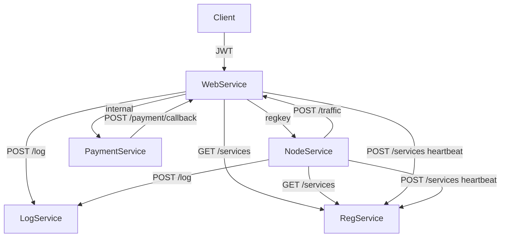

# distributed_xray API Reference

This document summarizes all HTTP APIs exposed by each microservice in the project.

---

## Authentication Overview

| Auth Type | How to Pass | Used By |
|---|---|---|
| **User JWT** | HTTP Header: `Authorization: <token>` | Client → WebService protected routes |
| **Admin Key** | HTTP Header: `regkey: <REGKEY>` | Admin → WebService admin routes |
| **Inter-Service Key** | HTTP Header: `regkey: <regkey>` | Service → Service calls |

> [!IMPORTANT]
> There are **two different keys**:
> - `REGKEY` (uppercase env var): Admin-facing key for admin API endpoints.
> - `regkey` (lowercase env var): Inter-service communication key used by services to authenticate each other.
>
> Both keys are accepted by `AdminAuth` middleware and the `GenerateVoucher` endpoint.

---

## 1. WebService

**Base URL:** `http://<PUBLIC_IP>:<GIN_PORT>` (default GIN_PORT = `8080`)

### 1.1 Public Endpoints (No Auth)

#### `POST /signup`
Register a new user account.

**Request Body (JSON):**
```json
{
  "Email": "user@example.com",
  "Password": "yourpassword"
}
```

**Response:** `200 OK` — `{}`

**Notes:**
- New users are placed on "Free plan" with 10 GB traffic and 1-year validity.
- Email verification is currently bypassed (`IsVerified: true`).

---

#### `POST /login`
Authenticate and receive a JWT token.

**Request Body (JSON):**
```json
{
  "Email": "user@example.com",
  "Password": "yourpassword"
}
```

**Response:** `200 OK`
```json
{
  "token": "<jwt_token>"
}
```

**Notes:** Token is valid for 30 days. Include it in `Authorization` header for protected routes.

---

#### `GET /verify?token=<token>`
Email verification link handler. Returns an HTML page (used directly in browser from verification email link).

**Query Params:** `token` — verification token from the email.

---

#### `GET /version?client-version=<version>`
Check if a client version is supported.

**Query Params:** `client-version` — e.g. `0.1.0`

**Response:** `200 OK` — `{}` if supported, `400 Bad Request` if not.

---

### 1.2 User Authenticated Endpoints

> All routes here require: `Authorization: <jwt_token>` header.

#### `GET /user`
Get current user info.

**Response:** `200 OK`
```json
{
  "email": "user@example.com",
  "uuid": "<uuid>",
  "plan": "Free plan",
  "plan_end": "2027-05-23T00:00:00Z",
  "renew_cycle": "2678400000000000",
  "next_renew": "2026-06-23T00:00:00Z",
  "traffic_used": 1234567,
  "traffic_limit": 10000000000,
  "balance": 0
}
```

---

#### `GET /realitykey`
Get the Xray Reality public key for configuring clients.

**Response:** `200 OK`
```json
{
  "pubkey": "<REALITY_PUBKEY>"
}
```

---

#### `GET /servers`
List all available node servers.

**Response:** `200 OK`
```json
{
  "servers": [
    {
      "ip": "1.2.3.4",
      "ipv6": "::1",
      "serviceid": "<service_uuid>",
      "description": "Node description",
      "tags": ["ipv4", "ipv6"]
    }
  ]
}
```

---

#### `POST /connect?serviceid=<serviceid>`
Connect to a VPN node. WebService proxies this to the NodeService.

**Query Params:** `serviceid` — the `serviceid` from `GET /servers`.

**Response:** `200 OK`
```json
{
  "port": "12345",
  "uuid": "<user_uuid>",
  "pubkey": "<REALITY_PUBKEY>"
}
```

**Notes:**
- Checks plan expiry and traffic limit before proceeding.
- Returns the proxy port on the node server that the client should connect to.
- Rate limits: Free plan = 10 Mbps, Premium plan = 200 Mbps.

---

#### `POST /heartbeat?serviceid=<serviceid>`
Send a keepalive heartbeat while connected. Must be called periodically (within 30s intervals).

**Query Params:** `serviceid` — the service ID of the connected node.

**Response:** `200 OK` — `{}`

---

#### `POST /subscribe`
Subscribe to a plan using account balance.

**Request Body (JSON):**
```json
{
  "plan": "Premium plan",
  "duration": 3
}
```

**Notes:**
- Only `"Premium plan"` is accepted.
- Price is `300` cents per month (hardcoded TODO).
- Deducts from user `balance`.

**Response:** `200 OK` — `{"status": "success"}`

---

#### `POST /redeem`
Redeem a voucher code.

**Request Body (JSON):**
```json
{
  "code": "VOUCHER123"
}
```

**Response:** `200 OK` — `{"message": "Voucher redeemed successfully"}`

**Voucher Types:**
- `"balance"` — adds `amount` (in cents) to user balance.
- `"plan"` — upgrades/extends plan by `plan_duration` months.

---

#### `POST /payment`
Create a payment order (initiates a TRX crypto payment).

**Request Body (JSON):**
```json
{
  "amount": 900,
  "currency": "USD",
  "method": "TRX"
}
```

**Response:** `200 OK`
```json
{
  "message": "Payment submitted",
  "order_id": "<uuid>",
  "trx_address": "<tron_address>",
  "actual_amount": 12345
}
```

---

#### `GET /payment/status/:order_id`
Get the status of a payment order.

**Path Params:** `order_id`

**Response:** `200 OK`
```json
{
  "order_id": "<uuid>",
  "status": "pending | paid"
}
```

---

#### `GET /payment/list`
List all payment orders for the authenticated user.

**Response:** `200 OK`
```json
{
  "payments": [ /* array of payment objects */ ]
}
```

---

### 1.3 Admin/Inter-Service Endpoints

> All routes here require: `regkey: <REGKEY or regkey>` header.

#### `POST /payment/callback?order_id=<order_id>`
Called by PaymentService to notify WebService that a payment is confirmed. Updates payment status to `"paid"` and credits the user's balance.

**Query Params:** `order_id`

**Response:** `200 OK` — `{"message": "Payment status updated"}`

---

#### `POST /admin/setplan`
*(Admin only)* Set a user's plan directly.

**Note:** This endpoint currently reads `uuid` and `plan` from path params (`c.Param`), but it's registered as `POST /admin/setplan` without path params — this is a **known bug** in the code.

**Response:** `200 OK` — `{"message": "Plan updated successfully", "user": {...}}`

---

#### `POST /admin/generatevoucher`
*(Admin only)* Create a new voucher.

**Request Body (JSON):**
```json
{
  "code": "VOUCHER123",
  "type": "balance",
  "description": "Test voucher",
  "expires_at": "2027-01-01T00:00:00Z",
  "amount": 1000,
  "plan_name": "",
  "plan_duration": 0
}
```

For plan vouchers:
```json
{
  "code": "PLANVOUCHER",
  "type": "plan",
  "description": "1 month premium",
  "expires_at": "2027-01-01T00:00:00Z",
  "amount": 0,
  "plan_name": "Premium plan",
  "plan_duration": 1
}
```

**Response:** `200 OK` — `{"message": "Voucher created successfully", "voucher": {...}}`

---

#### `POST /traffic`
*(Internal)* Called by NodeService to report traffic usage for connected users. No auth required (internal network assumed).

**Request Body (JSON):**
```json
[
  {"uuid": "<user_uuid>", "traffic": 1048576},
  {"uuid": "<user_uuid2>", "traffic": 204800}
]
```

**Response:** `200 OK` — `{"status": "success"}`

---

## 2. NodeService

**Base URL:** `http://<NODE_PUBLIC_IP>:<Node_Port>` (default Node_Port = `80`)

> All endpoints require `regkey: <regkey>` header AND the request must originate from a registered WebService IP.

#### `GET /connect?uuid=<uuid>&email=<email>&clientip=<ip>&rate=<bps>&burst=<bps>`
Add a user to Xray and start a rate-limited TCP proxy. Called by WebService.

**Query Params:**
| Param | Required | Description |
|---|---|---|
| `uuid` | Yes | User UUID |
| `email` | Yes | User email |
| `clientip` | Yes | Client's IP address |
| `rate` | No | Rate limit in bytes/sec (defaults to plan default) |
| `burst` | No | Burst limit in bytes/sec |

**Response:** `200 OK`
```json
{
  "port": "23456"
}
```

---

#### `POST /disconnect`
Disconnect one or more users and stop their proxy sessions.

**Request Body (JSON):**
```json
["<uuid1>", "<uuid2>"]
```

**Response:** `200 OK`

---

#### `GET /info`
Get node server resource info (CPU/memory usage).

**Request Body:** Any non-empty body.

**Response:** `200 OK`
```json
{
  "cpu_usage": 12.5,
  "memory_total": 8589934592,
  "memory_used": 2147483648,
  "memory_used_percent": 25.0
}
```

---

#### `GET /limit` *(unimplemented)*
Placeholder endpoint (returns 404 by default).

---

## 3. LogService

**Base URL:** `http://<LOG_SERVICE_URL>`

#### `POST /log`
Write a log message to the log file. Called internally by other services via `SetClientLogger`.

**Request Body:** Plain text — the log message.

**Response:** `200 OK`

**Log format in file:**
```
[distributed-xray] - 2026/05/23 19:42:16 [ServiceName|ServiceID|PublicIP|PublicIPv6] - <message>
```

---

## 4. PaymentService (Order Service)

**Base URL:** `http://<PAYMENT_SERVICE_URL>`

#### `POST /api/payment/order/create`
Create a new TRX payment order.

**Query Params:**
| Param | Description |
|---|---|
| `order_id` | Pre-generated UUID for the order |
| `amount` | Amount in cents |
| `callback` | URL-encoded callback URL for payment confirmation |
| `method` | Payment method (e.g. `TRX`) |
| `currency` | Currency (e.g. `USD`) |

**Response:** `200 OK` — JSON order object including `trx_address` and `actual_amount`.

---

#### `GET /api/payment/order/status?order_id=<id>`
Get the status of an existing order.

**Query Params:** `order_id`

**Response:** `200 OK` — JSON order object with `status` field (`pending`, `paid`, `callback_failed`, etc.).

---

## 5. RegService (Registry)

**Base URL:** `http://<REGISTRY_IP>:<Registry_Port>` (default port = `80`)

#### `POST /services`
Register a new service instance.

**Auth:** `regkey: <regkey>` header required.

**Request Body (JSON):**
```json
{
  "ServiceName": "NodeService",
  "ServiceURL": "http://1.2.3.4:80",
  "PublicIP": "1.2.3.4",
  "PublicIPv6": "::1",
  "Description": "My node",
  "RequiredServices": ["LogService", "WebService"],
  "ServiceUpdateURL": "http://1.2.3.4:80/services",
  "Tags": ["ipv4", "ipv6"]
}
```

**Response:** `200 OK` — Plain text `<ServiceID>` (UUID assigned by registry).

---

#### `GET /services?serviceName=<name>`
Query all registered instances of a service type.

**Query Params:** `serviceName` — one of `LogService`, `NodeService`, `WebService`, `PaymentService`, `ShellService`.

**Response:** `200 OK` — JSON array of `Registration` objects.
```json
[
  {
    "ServiceName": "NodeService",
    "ServiceURL": "http://1.2.3.4:80",
    "ServiceID": "<uuid>",
    "PublicIP": "1.2.3.4",
    "PublicIPv6": "",
    "Description": "...",
    "RequiredServices": ["LogService", "WebService"],
    "ServiceUpdateURL": "http://1.2.3.4:80/services",
    "Tags": ["ipv4"]
  }
]
```

---

#### `DELETE /services?serviceName=<name>`
Deregister a service instance.

**Query Params:** `serviceName`

**Request Body:** Plain text — the `ServiceURL` to remove.

**Response:** `200 OK`

---

#### `POST /heartbeat/<ServiceID>`
Keepalive heartbeat. Called automatically by every service every 3 seconds. Services are removed from the registry if no heartbeat is received within 20 seconds.

**Auth:** Validated by the registry using the stored `ServiceID`.

**Response:** `200 OK` or `401 Unauthorized` if service is not registered.

---

#### `POST /services` *(Service Update Push)*
Each service exposes a `ServiceUpdateURL` path (typically `/services`). The Registry pushes updates to this endpoint when required services are added or removed.

**Auth:** `regkey: <regkey>` header required.

**Request Body (JSON):**
```json
{
  "added": [ /* array of Registration */ ],
  "removed": [ /* array of Registration */ ]
}
```

---

## 6. ShellService

> [!CAUTION]
> This service executes arbitrary shell commands on the host. It should **never** be exposed publicly.

**Base URL:** `http://<SHELL_SERVICE_URL>`

#### `POST /shell`
Execute a shell command on the server.

**Request Body:** Plain text — the command to run.

**Response:** `200 OK` — `Command executed: <cmd> <output>`

---

## Inter-Service Call Flow Summary


